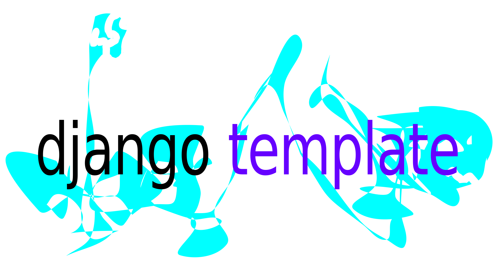

<p align="center">
  <a href="https://github.com/AvishrantsSh/Django-Template">
    
  </a>

  <h2 align="center">Django Template</h2>

  <p align="center">
    An awesome way to kickstart your Django projects!
    <br>
    <a href="https://github.com/AvishrantsSh/Django-Template/issues">Report Bug</a>
    ·
    <a href="https://github.com/AvishrantsSh/Django-Template/issues">Request Feature</a>
  </p>
</p>
<br>
<p align="center">
  <a href="https://github.com/AvishrantsSh/Django-Template/graphs/contributors">
    
  </a>
  <a href="https://github.com/AvishrantsSh/Django-Template/network/members">
    
  </a>
  <a  href="https://github.com/AvishrantsSh/Django-Template/stargazers">
    
  </a>
  <a href="https://github.com/AvishrantsSh/Django-Template/issues">
    
  </a>
  <a href="https://github.com/AvishrantsSh/Django-Template/blob/main/LICENSE">
    
  </a>
</p>

<br>
<!-- TABLE OF CONTENTS -->

## Table of Contents
<ol>
  <li>
    <a href="#about-the-project">About The Project</a>
  </li>
  <li>
    <a href="#getting-started">Getting Started</a>
    <ul>
      <li><a href="#prerequisites">Prerequisites</a></li>
      <li><a href="#installation">Installation</a></li>
    </ul>
  </li>
  <li><a href="#usage">Usage</a></li>
  <li><a href="#contributing">Contributing</a></li>
  <li><a href="#license">License</a></li>
</ol>


<!-- ABOUT THE PROJECT -->
## About The Project

Managing your Django project and all its dependencies can be a nightmare. This also includes managing dependencies in virtual environments, securing your `SECRET KEY`, adding files to `.gitignore`, running code style validations and what not.

Why not simplify this tedious and repetetive work? 

With this objective in mind, I created `Django Template`, a simple and minimalistic django project template that fits all your requirements. 


<!-- GETTING STARTED -->
## Getting Started

Simply click on [Use this template](https://github.com/AvishrantsSh/Django-Template/generate) button on top to get started. Go ahead and choose a cool name for your project. Clone the newly created repository and continue with the following steps.

### Prerequisites

This project is optimized to run on Linux Environments. Tests for Windows and Mac are still in progress.

### Installation

After getting a local copy on your system, run the following commands based on your role.

- ### Making a new Django Project
    If you are a developer who is just starting with a new project, simply run
    ```sh
    make project
    ```
    A prompt will ask you to enter a valid project name before continuing. This command will setup your virtual environment, secret keys and all the basic dependencies required by a django project.

    
    
    _Note: While developing, it is advisable to enter your **virtual environment** for proper configuration and better control. To enter a virtual environment, use_
    ```sh
    . bin/activate
    ```

    _To deactivate the environment, simply use `deactivate` command_
    ```
    deactivate
    ```
    ___
    Alternatively, if you prefer a finer control over your project creation,you can use the following commands
    - Install all project dependencies and create virtual environment
        ```sh
        make install
        ```

    - Make django project using `django-admin`
        ```sh
        django-admin startproject --template=./etc/structure ${project-name} .
        ```

      Replace `${project-name}` with the name of Django project as per your wish. Also, you can customize the template for your project,according to your need.

    _Note: This directory will now function as your root django folder. Upon creation of a project, a folder named `${project-name}` and `manage.py` will appear at the root._
  ___

- ### Running an existing Django Project
    If the repository already contains a django project, you can simply install the requirements and run the project.

    To install all the dependencies, use
    ```sh
    make install
    ```

<!-- USAGE EXAMPLES -->
## Usage

You can use `make` commands to perform various operations on your django project.
1. Start django server on port `8000`. You can customize it by editing `PORT` in `Makefile`. 
    ```sh
    make run
    ```

2. Apply database migrations
    ```sh
    make migrate
    ```

3. Clear database records.
    ```sh
    make flush
    ```
     _Note: Media files will not be deleted using this command_

4. Update project requirements (useful for deployment)
    ```sh
    make freeze
    ```
   This command will add all your project dependencies to `etc/requirements.txt`, making it very easy for deployment.

5. Running Django Testcases
    ```sh
    make test
    ```

5. Check for proper formatting and import style using `black` and `isort`
    ```sh
    make format
    ```

<!-- CONTRIBUTING -->
## Contributing

Contributions are what make the open source community such an amazing place to be learn, inspire, and create. Any contributions you make are **greatly appreciated**.

1. Fork the Project
2. Create your Feature Branch (`git checkout -b feature/AmazingFeature`)
3. Commit your Changes (`git commit -m 'Add some AmazingFeature'`)
4. Push to the Branch (`git push origin feature/AmazingFeature`)
5. Open a Pull Request

<!-- LICENSE -->
## License

Distributed under the MIT License. See `LICENSE` for more information.
